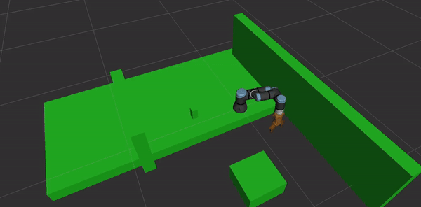

# Starbots.AI: Automated Cafeteria Documentation

Starbots.AI Cafeteria: Caffeinating Your Workspace

---

## Introduction

Starbots.AI revolutionizes the traditional cafeteria experience with cutting-edge automation. Imagine a scenario where you can simply place an order and have a freshly brewed cup of coffee delivered directly to your workspace. Intriguing, isn't it? At the heart of this innovation lies the UR3e Robotic Arm, seamlessly orchestrated by the MoveIt2 package, ensuring precise and efficient operation of the entire cafeteria setup.

But what makes Starbots.AI truly remarkable is its intricate system, meticulously designed to handle every aspect of the process. Let's delve into the key components that bring this futuristic vision to life.

---

### Starbots.AI Cafeteria Setup

How does the real-world cafeteria setup look?


### How This Setup Works

Let's have a closer look at the flowchart:


- **Entry Triggers - Google Assistant:** Connected to IFTTT Smart Integrations platform via Google Home architecture. All voice commands targeting IFTTT configuration trigger an HTTP GET API request.
- **Entry Triggers - Website:** The Starbots.AI commercial website can place remote orders using an HTTP API request to Jenkins. Through rosbridge, the website also receives feedback of the live stream of the entire process.
- **Jenkins:** This platform listens to remote requests with a Build Token Root Plugin for authentication. Two pipelines exist: Activation and Cancellation of Orders. Once activated, the pipeline connects to the ROS2 shell and launches the master launch file.
- **MoveIt2 Motion Planner:** The UR3e robotic arm is planned and controlled by the MoveIt2 package, specifically the move_group node, which listens to the `/planning_scene_world` topic to avoid collisions.

---

## Challenges and Outcomes

### 1. Planners and Trajectories

The Starbots.AI Cafeteria has a tight setup with cup dispenser, coffee machine, table, and a wall. It's crucial to plan the UR3e robot's travel from one position to another. The MoveIt2 package provides **collision-free trajectories**.

- **KDL Inverse Kinematics Plugin:** Used by MoveIt2 to compute joint positions or angles for a given end-effector pose or the waypoints in a Cartesian path.
    - *Why KDL?* Default plugin in MoveIt, more robust, and computationally less expensive.
- **OMPL Planner:** OMPL generates collision-free trajectories by exploring the configuration space (C-space) of the robotic arm.
    - *Why OMPL?* Provides a wide range of sampling-based motion planning algorithms with efficient convergence.



### 2. Perception

The task requires precise detection of the coffee cup's position, achieved through an Intel Realsense D435 RGBD Camera for RGB, Depth Image, and PointCloud data.

#### Challenges
- Detecting the cup’s position in a 2D image.
- Utilizing the depth image accurately.
- Addressing remote accessibility issues for PointCloud data.


---

#### Perception Pipeline
1. Collected 50 images of the coffee cup and manually recorded bounding box values.
2. Built and trained a Convolutional Neural Network (CNN) to predict bounding boxes, achieving a loss of 3.6911.
3. Introduced offsets (x_offset = -16, y_offset = 24) for correction between RGB and Depth image centroids.


Using depth and camera intrinsic values, the x and y pose of the cup are computed:

$$
x_{\mathrm{final}} = \mathrm{depth} \times \frac{\mathrm{centroid_x} - \mathrm{cx}}{\mathrm{fx}} - e_x
$$

$$
y_{\mathrm{final}} = \mathrm{depth} \times \frac{\mathrm{centroid_y} - \mathrm{cy}}{\mathrm{fy}} - e_y
$$


### 3. Barista

Ensuring precision is essential when dropping the coffee cup into the cup holders. Slight angular deflections may cause the cup to fall. Cartesian planning and joint-state space goals ensure precise placement.


---

## Final Output

### Gazebo Simulation


### Real World Output


### Website Screenshots


---

## Installation and Execution Instructions

After cloning the repository, follow these steps to build and execute the project.

### Step 1: Clone the Repository

```bash
git clone git@github.com:therealnaveenkamal/starbots.git
cd starbots
```

### Step 2: Build the Project

Ensure you are in the root of your ROS2 workspace, then run:

```bash
colcon build
```

### Step 3: Execute Project Scripts

1. **Start the raw broadcaster:**
   ```bash
   python3 ~/ros2_ws/src/cone_detection/src/cone_detection/raw_broadcaster.py
   ```

2. **Run the cone test script:**
   ```bash
   python3 ~/ros2_ws/src/cone_detection/src/cone_detection/cone_test.py
   ```

3. **Launch MoveIt2 and Motion Planning Nodes:**

   a. Launch the `move_group` node for controlling the robotic arm:
   ```bash
   ros2 launch arm_real move_group.launch.py
   ```

   b. Launch RViz for visualizing the arm in MoveIt2:
   ```bash
   ros2 launch arm_real moveit_rviz.launch.py
   ```

4. **Execute Pick and Place Tasks:**

   a. Run the main pick and place task:
   ```bash
   ros2 launch moveit2_scripts pick_and_place.launch.py use_sim_time:=False
   ```

   b. Alternatively, execute the pick task for hole0:
   ```bash
   ros2 launch moveit2_scripts pick_hole0.launch.py use_sim_time:=False
   ```

---
